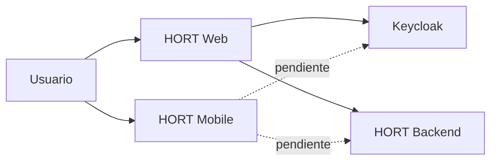
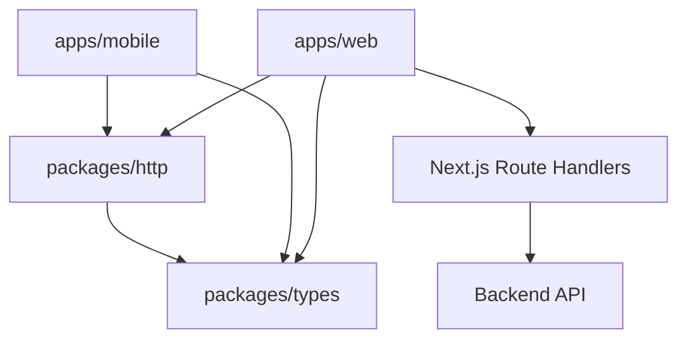

# Diagramas

Los diagramas se mantienen en Markdown con Mermaid para revisarlos con el código.

```mermaid
flowchart LR
    User[Usuario] --> Web[HORT Web]
    User --> Mobile[HORT Mobile]
    Web --> Keycloak[Keycloak]
    Web --> Backend[HORT Backend]
    Mobile -. pendiente .-> Keycloak
    Mobile -. pendiente .-> Backend
```

```mermaid
flowchart TD
    Web[apps/web] --> Http[packages/http]
    Web --> Types[packages/types]
    Mobile[apps/mobile] --> Http
    Mobile --> Types
    Http --> Types
    Web --> Routes[Next.js Route Handlers]
    Routes --> Backend[Backend API]
```
